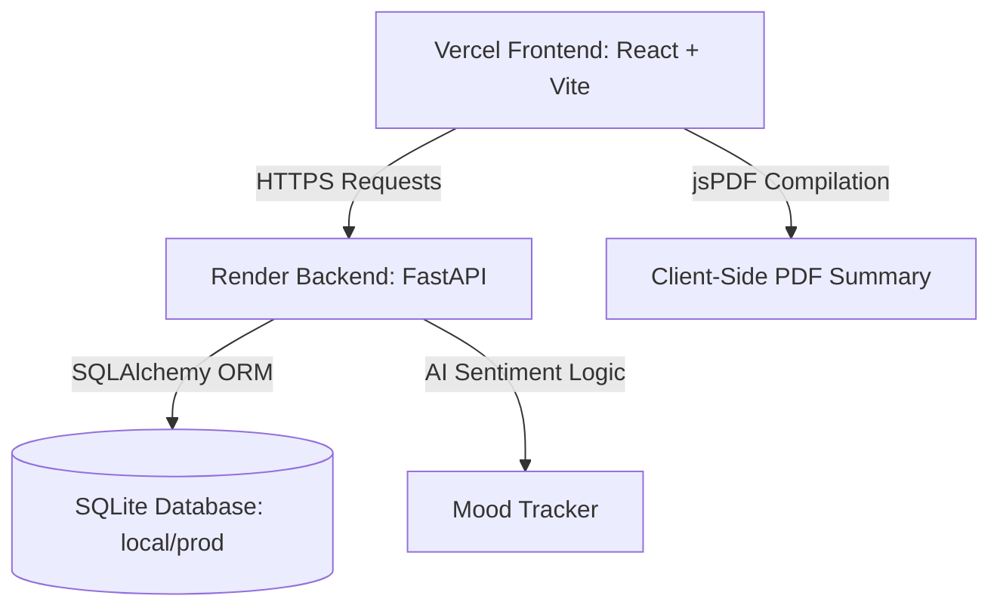
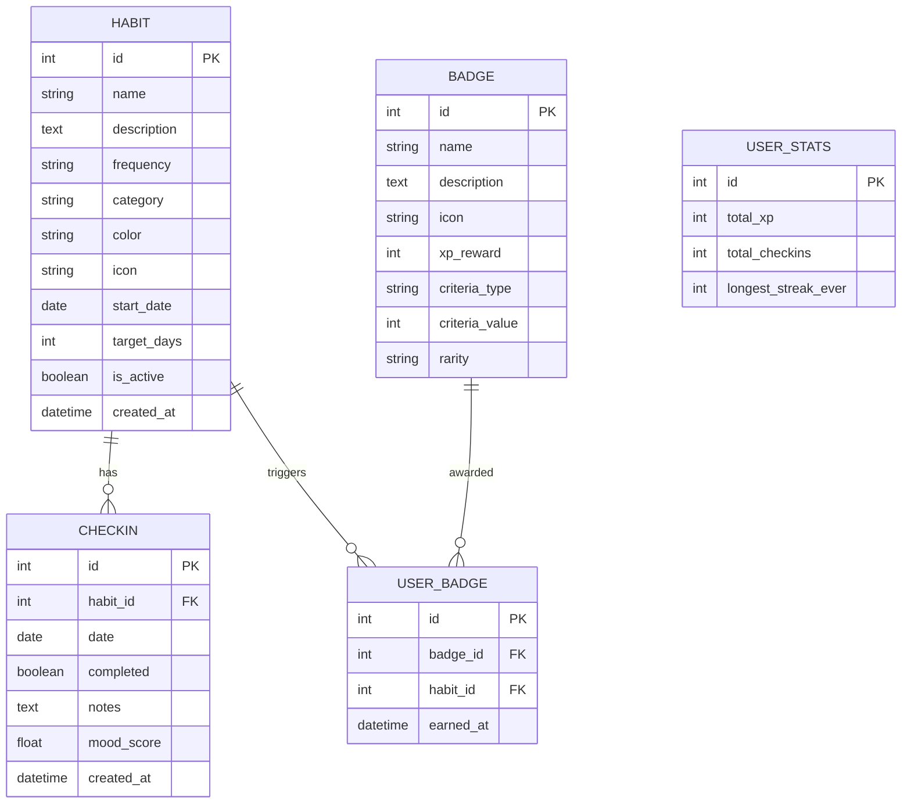

# 🏆 HabitHero — Full Stack Habit Tracker Documentation

HabitHero is a premium, full-stack habit tracking web application designed to help users establish and maintain daily routines. The application incorporates a clean visual aesthetic, gamified XP progression, interactive weekly and category analytics, automatic negation-aware AI sentiment analysis of check-in diaries, and custom PDF report compilation.

---

## 🏛️ System Architecture & Tech Stack

HabitHero is split into a decoupled frontend and backend service architecture, enabling independent deployment and clean separation of concerns.

### 1. Frontend (React + Vite)
- **Vite**: Ultra-fast build tool for modern React applications.
- **Recharts**: Declarative charts for rendering the weekly check-in bar charts and category pie charts.
- **Lucide React**: Clean vector icon pack.
- **jsPDF**: Client-side PDF generation engine.
- **Axios**: Promised-based HTTP client for consuming API endpoints.
- **CSS3 (Vanilla)**: Structured glassmorphic stylesheet with HSL colors, responsive design layouts, and micro-animations.

### 2. Backend (FastAPI)
- **FastAPI**: Modern, high-performance web framework for Python 3.11+.
- **SQLAlchemy ORM**: Object-Relational Mapper for SQLite databases.
- **Pydantic v2**: Data validation and serialization schemas.
- **Uvicorn**: High-performance ASGI web server.

---

## 🗃️ Database Schema

The database consists of 5 core tables. Relationships are managed dynamically via SQLAlchemy.

---

## 💡 Feature Implementation Deep Dive

### 1. Negation-Aware Sentiment Engine
The mood analysis engine in `ai_service.py` processes daily check-in notes to determine emotional sentiment on a scale from `-1.0` (Highly Negative) to `+1.0` (Highly Positive).

Unlike simple keyword matching, this engine is **negation-aware**. It scans word tokens in chronological order and checks if a negation word (e.g., *not, never, don't, wasn't, lack, no*) appears within **two words** prior to an emotional keyword. If found, the sentiment value of the keyword is inverted.

* **Example 1**: `"I had a bad day"` → Keyword `bad` (-0.6) → Score: `-0.6`
* **Example 2**: `"Today was not bad"` → Negation `not` + Keyword `bad` (-0.6) → Inverted Score: `+0.6` (Positive)

### 2. Date-Specific Check-ins (Historical Calendar)
The app supports historical tracking. The `getHabits` API call takes an optional `target_date` parameter (defaulting to today). 
* When a user changes the calendar date selector on the **My Habits** page, it queries the backend for the completion status on that specific date.
* When a check-in is toggled, it records or deletes the `Checkin` record for the targeted date.

### 3. Analytics PDF Summary Compiler
Using `jsPDF`, the **Download PDF Summary** button in `AnalyticsPage.jsx` triggers a client-side vector render. Emojis are stripped to prevent PDF font crashes, and the system draws:
* A header with overall stats (total habits, success rates, active streaks).
* A **Category Breakdown** layout including horizontal progress bars calculated as a percentage of total habits.
* An **Active Habits Table** showing habit names, categories, tracking frequency, and streaks.

### 4. Gamification Level Calculation
XP thresholds progress geometrically. The level calculation formula behaves as follows:
* **Thresholds**: Level 1 (0 XP) · Level 2 (500 XP) · Level 3 (1500 XP) · Level 4 (3500 XP) · Level 5 (7500 XP)
* Check-ins reward `+10 XP`. Badges reward up to `+750 XP`.

---

## 🔌 API Endpoints Reference

### Habits
* `GET /habits?target_date=YYYY-MM-DD` — List active habits with completion status on the target date.
* `POST /habits` — Create a new habit.
* `GET /habits/{id}` — Fetch details for a specific habit.
* `PUT /habits/{id}` — Update a habit's configurations.
* `DELETE /habits/{id}` — Archive/delete a habit.

### Check-ins
* `POST /habits/{id}/checkin` — Record a check-in (with optional diary `notes`).
* `DELETE /habits/{id}/checkin/{date}` — Remove a check-in for a specific date.
* `GET /habits/notes` — Get a feed of all check-ins that contain text diaries.

### Analytics
* `GET /analytics/overview` — Fetch aggregated analytics overview (success rates, category stats, weekly check-in trends).
* `GET /analytics/habits/{id}` — Get detailed history for a single habit.

### Gamification & AI
* `GET /badges` — List all badges and whether the user has unlocked them.
* `GET /badges/stats` — Fetch level, total XP, and badge count.
* `GET /ai/quote` — Fetch a motivational quote based on recent mood.
* `GET /ai/suggestions` — Fetch habit recommendations based on category gaps.

---

## 🌐 Production Deployment Guide

### Backend: Render
1. Deploy as a **Web Service** pointing to the repository.
2. Set the **Root Directory** to `backend`.
3. Select **Python** runtime and use the Build Command: `pip install -r requirements.txt`.
4. Set the environment variable:
   * `PYTHON_VERSION` = `3.11.9`
   * `CORS_ORIGINS` = `https://<your-vercel-frontend-domain>.vercel.app` (exclude trailing slashes).
   
*Note: Because Render's Free tier is stateless, SQLite database files will reset when the instance goes idle or redeploys.*

### Frontend: Vercel
1. Deploy as a new project pointing to the repository.
2. Set the **Root Directory** to `frontend` and choose the **Vite** preset.
3. Configure Environment Variables:
   * `VITE_API_URL` = `https://<your-render-backend-domain>.onrender.com`
4. Deploy, copy the Vercel URL, and add it to the backend `CORS_ORIGINS`.
